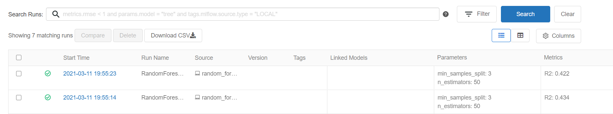

# Tracking Metrics in MLflow
You can track the metrics for different models along with the hyper-parameters easily.



## Installation
```
$ pip install mlflow
```

## How to?
#### 1. Start MLflow UI by

```
$ mlflow UI
```
> By default it will open the UI on port 5000.

#### 2. Run the training script of each model
```
$ python linear_regression.py
$ python random_forest_regression.py
```

You'll see 2 rows in MLflow UI and you'll be able to compare their results and also tune the hyperparameters to see the changes in result.

Next, we'll see how to store these results in database.